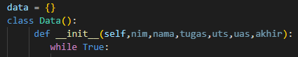
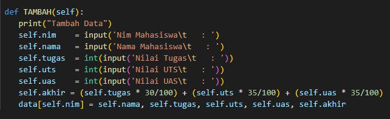
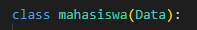
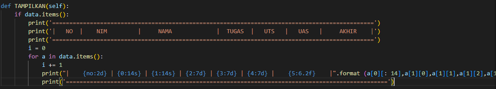
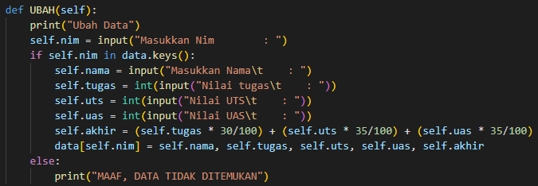
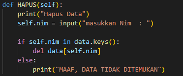

# LANGKAH - LANGKAH PRAKTIKUM 8

## Tugas Praktikum 

1. Membuat dictionary kosong.
2. Membuat class untuk menampung fungsi.

3. Gunakan def "Tambah" Menambahkan data.

4. Membuat class baru supaya isi data terhubung ke fungsi lainnya.

5. Gunakan def "Tampilkan" untuk menampilkan data.

6. Gunakan def "Ubah" untuk menghapus data.

7. Gunakan def "Hapus" untuk mengubah data.

